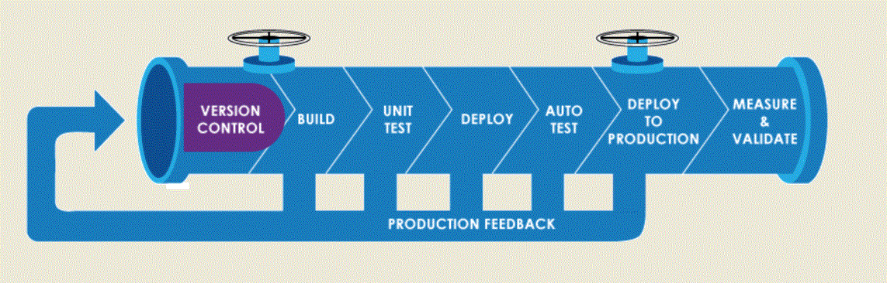

## Hi Geeks, 👋

##### Welcome to my GitHub,

 [](https://github.com/AneeshkbAwait)
<a href="https://www.youtube.com/watch?v=dQw4w9WgXcQ"></a>

<p align="center">

</p>
<br>
<hr>

<center> </img></center>

[](#) [](#) [](#) [](#) [](#) [](#) [](#) [](#) [](#) [](#) [](#)        [](#)         [](#) 
<hr>


```
---
- Name: Aneesh K B
  hosts: GitHub
  become: true
    - Cloud platform:
        - AWS
        - Azure
    - Containerization:
        - Kubernetes
        - AKS
        - Docker
        - ECS
    - GitOps and Package Management
        - Helm
        - ArgoCD
    - Infrastructure As a Code:
        - Terraform
        - Ansible
    - Continuous Integration/Continuous Deployment:
        - GitHub Actions
        - Jenkins
        - GitLab
    - Data Engineering and Analytics
        - Databricks
        - Azure Synapse
    - Operating Systems:
        - RedHat Linux Release 6.x, 7.x
        - Ubuntu 18.04, 20.04, 22.02, 24.02
        - CentOS 6.x, 7.x
        - Kali Linux 2018-4, 2020-2
        - Windows Server 2008, 2012, 2016, 2019
    - Scripting Languages:
        - Bash
        - Python    
    - Software Provisioning/Configuration Management:
        - Ansible
    - Machine Image As a Code: 
        - Packer
    - Source Code Management/Version Control:
        - Git (GitHub, GitLab)
    - Database Management Systems:
        - Microsoft SQL Server
        - MySQL
        - MariaDB
    - Secrets Management Tool:
        - HashiCorp Vault
    - Project Management Tool:
        - GitHub
    - Monitoring Tools:
        - AWS CloudWatch
        - Grafana
        - Nagios
        - Zabbix
        - Dynatrace
    - Certifications:
        - RedHat Certified System Administrator (RedHat Certified)
        - Redhat Certified Systems Engineer (RedHat Certified)
```     
<a href="https://www.youtube.com/watch?v=dQw4w9WgXcQ"></a>

### ⚙️ GitHub Analytics

[](https://github.com/AneeshkbAwait)
[](https://github.com/AneeshkbAwait)

<a href="https://www.youtube.com/watch?v=dQw4w9WgXcQ"></a>

### ⚙️ Connect with Me

<!-- ----------- CONNECT WITH ME SECTION ------------ -->
<p align="center">

</p>

<br>
<div align="center">
  <br>
  <p><b>Thank you for your time.</b><br>
    It was nice having you here.<br><br>
    If you have any queries or just wanna say <i>Hi</i>,&nbsp;
<p align="center">
<a href="mailto:aneeshawaits@gmail.com"></a>
<a href="https://www.linkedin.com/in/aneesh-kb-95172990"></a> 
<a href="https://www.instagram.com/aneeshkb"></a>
<a href="https://wa.me/%2B917736494224?text=This%20message%20from%20GitHub."></a>
  </a></p>
</div>

<h1 align="center">See You Later! <br></h1>

<a href="https://www.youtube.com/watch?v=dQw4w9WgXcQ"></a>
